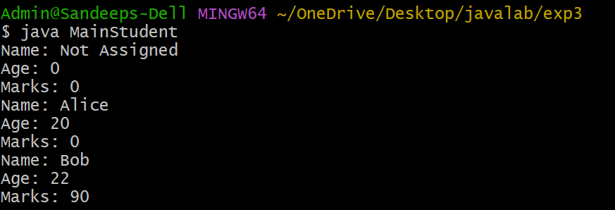
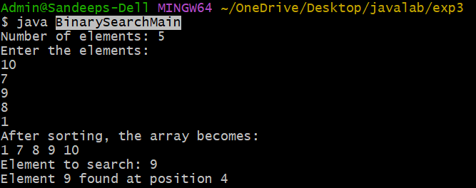

# Experiment 3a

## AIM :constructor overloading

``` java
student.java--file
class Student {
    String name;
    int age;
    int marks;

    Student() {
        name = "Not Assigned";
        age = 0;
        marks = 0;
    }

    Student(String n, int a) {
        name = n;
        age = a;
        marks = 0;
    }

    Student(String n, int a, int m) {
        name = n;
        age = a;
        marks = m;
    }

    void display() {
        System.out.println("Name: " + name);
        System.out.println("Age: " + age);
        System.out.println("Marks: " + marks);
    }
}
main--java file
class MainStudent {
    public static void main(String[] args) {
        Student s1 = new Student();
        Student s2 = new Student("Alice", 20);
        Student s3 = new Student("Bob", 22, 90);

        s1.display();
        s2.display();
        s3.display();
    }
}
```
##OUTPUT

# Experiment 3b

## AIM :binary search


``` java
binary search -file
import java.util.Arrays;

class BinarySearch {

    // Method to perform binary search
    int search(int[] arr, int key) {

        int low = 0;
        int high = arr.length - 1;

        while (low <= high) {

            int mid = (low + high) / 2;

            if (arr[mid] == key) {
                return mid;   // element found
            }
            else if (arr[mid] < key) {
                low = mid + 1;
            }
            else {
                high = mid - 1;
            }
        }
        return -1;  // element not found
    }

    // Method to sort array
    void sortArray(int[] arr) {
        Arrays.sort(arr);
    }
}
main--file
import java.util.Scanner;

class BinarySearchMain {

    public static void main(String[] args) {

        Scanner sc = new Scanner(System.in);

        System.out.print("Number of elements: ");
        int n = sc.nextInt();

        int[] arr = new int[n];

        System.out.println("Enter the elements:");
        for (int i = 0; i < n; i++) {
            arr[i] = sc.nextInt();
        }

        BinarySearch bs = new BinarySearch();

        // Sort the array
        bs.sortArray(arr);

        System.out.println("After sorting, the array becomes:");
        for (int i = 0; i < n; i++) {
            System.out.print(arr[i] + " ");
        }
        System.out.println();

        System.out.print("Element to search: ");
        int key = sc.nextInt();

        int result = bs.search(arr, key);

        if (result != -1) {
            System.out.println("Element " + key + " found at position " + (result + 1));
        } else {
            System.out.println("Element " + key + " not found in the list");
        }

        sc.close();
    }
}
```
##OUTPUT


