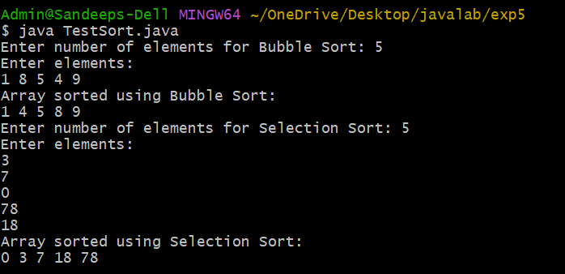
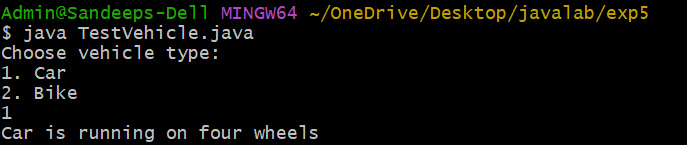
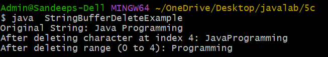

# Experiment 5a
## AIM: To write a JAVA program to implement Interface.
```
java

// Sortable.java
public interface Sortable {
    void sort(int[] arr);
}

// BubbleSort.java
public class BubbleSort implements Sortable {

    public void sort(int[] arr) {
        int n = arr.length;
        for (int i = 0; i < n - 1; i++) {
            for (int j = 0; j < n - i - 1; j++) {
                if (arr[j] > arr[j + 1]) {
                    int temp = arr[j];
                    arr[j] = arr[j + 1];
                    arr[j + 1] = temp;
                }
            }
        }
    }
}

// SelectionSort.java
public class SelectionSort implements Sortable {

    public void sort(int[] arr) {
        int n = arr.length;
        for (int i = 0; i < n - 1; i++) {
            int min = i;
            for (int j = i + 1; j < n; j++) {
                if (arr[j] < arr[min]) {
                    min = j;
                }
            }
            int temp = arr[min];
            arr[min] = arr[i];
            arr[i] = temp;
        }
    }
}

// TestSort.java
import java.util.Scanner;

public class TestSort {

    static void printArray(int[] arr) {
        for (int x : arr) {
            System.out.print(x + " ");
        }
        System.out.println();
    }

    public static void main(String[] args) {

        Scanner sc = new Scanner(System.in);

        // -------- Bubble Sort Input --------
        System.out.print("Enter number of elements for Bubble Sort: ");
        int n1 = sc.nextInt();

        int[] arr1 = new int[n1];
        System.out.println("Enter elements:");
        for (int i = 0; i < n1; i++) {
            arr1[i] = sc.nextInt();
        }

        Sortable ref = new BubbleSort();
        ref.sort(arr1);
        System.out.println("Array sorted using Bubble Sort:");
        printArray(arr1);

        // -------- Selection Sort Input --------
        System.out.print("Enter number of elements for Selection Sort: ");
        int n2 = sc.nextInt();

        int[] arr2 = new int[n2];
        System.out.println("Enter elements:");
        for (int i = 0; i < n2; i++) {
            arr2[i] = sc.nextInt();
        }

        ref = new SelectionSort();
        ref.sort(arr2);
        System.out.println("Array sorted using Selection Sort:");
        printArray(arr2);

        sc.close();
    }
}
```


## output:


# Experiment 5b
## AIM: To write a JAVA program that implements Runtime polymorphism
java
```

// Vehicle.java
public class Vehicle {
    public void run() {
        System.out.println("Vehicle is running");
    }
}

// Car.java
public class Car extends Vehicle {

    @Override
    public void run() {
        System.out.println("Car is running on four wheels");
    }
}

// Bike.java
public class Bike extends Vehicle {

    @Override
    public void run() {
        System.out.println("Bike is running on two wheels");
    }
}

// TestVehicle.java
import java.util.Scanner;

public class TestVehicle {
    public static void main(String[] args) {

        Scanner sc = new Scanner(System.in);
        Vehicle v;   // parent reference

        System.out.println("Choose vehicle type:");
        System.out.println("1. Car");
        System.out.println("2. Bike");

        int choice = sc.nextInt();

        if (choice == 1) {
            v = new Car();   // dynamic assignment
        } else if (choice == 2) {
            v = new Bike();  // dynamic assignment
        } else {
            v = new Vehicle(); // default
        }

        v.run();   // runtime polymorphism

        sc.close();
    }
}
```


## output:


# experiment 5c
## AIM: To write a JAVA program using StringBuffer to delete, remove character.
java
```
public class StringBufferDeleteExample {
    public static void main(String[] args) {

        // Step 1: Create StringBuffer object
        StringBuffer sb = new StringBuffer("Java Programming");

        // Step 2: Display original string
        System.out.println("Original String: " + sb);

        // Step 3: Delete single character at index 4
        sb.deleteCharAt(4);
        System.out.println("After deleting character at index 4: " + sb);

        // Step 4: Delete range of characters from index 0 to 4
        sb.delete(0, 4);
        System.out.println("After deleting range (0 to 4): " + sb);
    }
}
```

## output:


